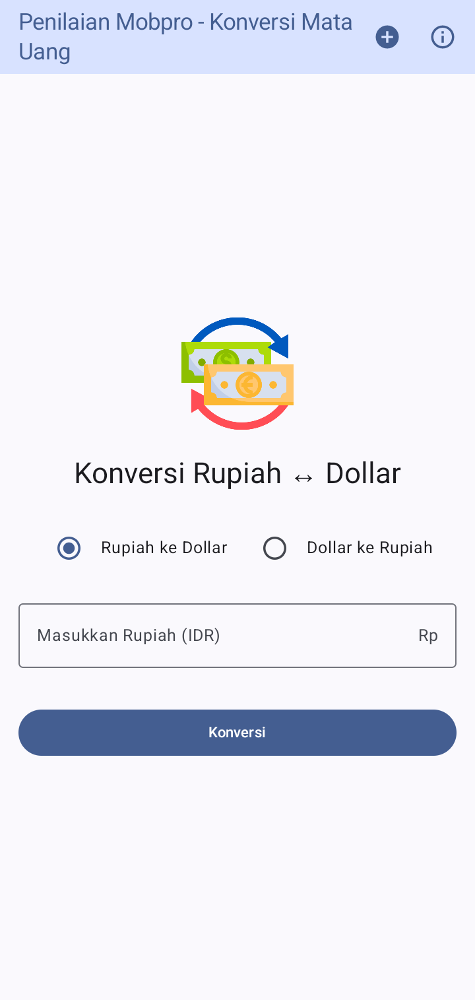
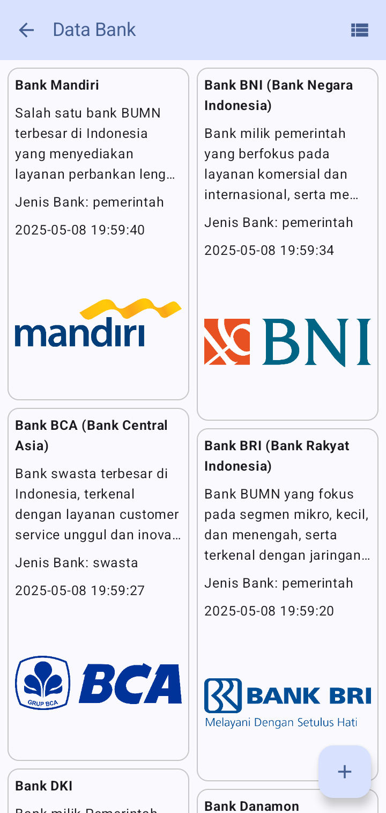
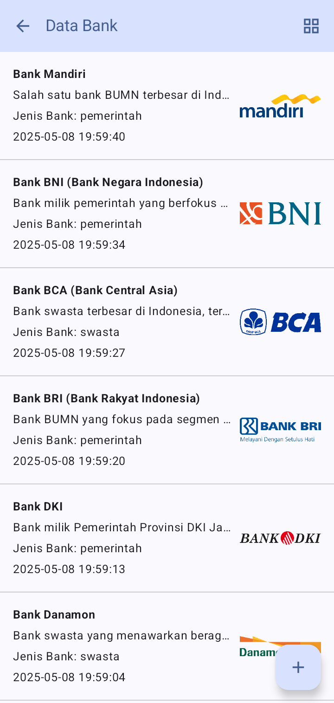
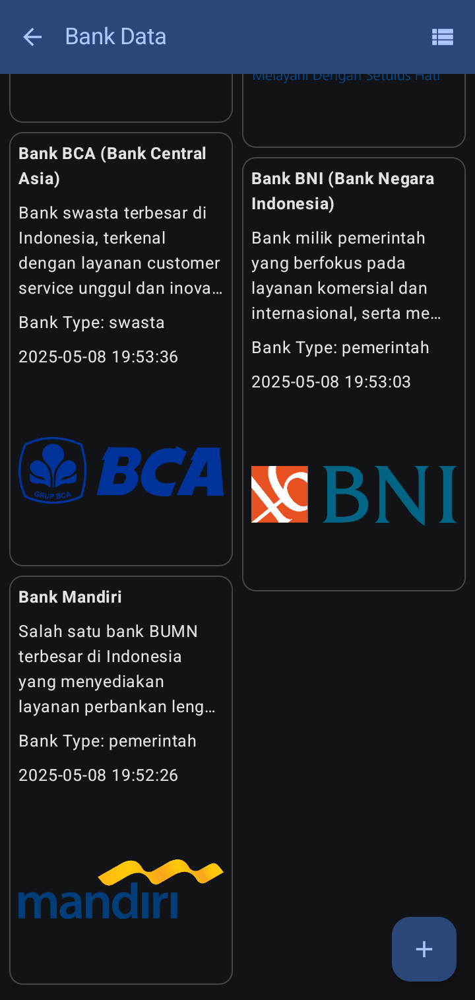
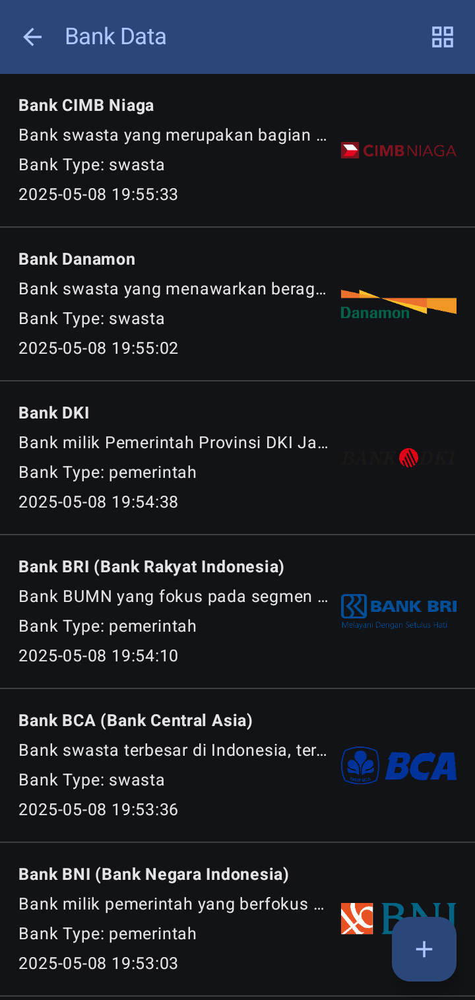
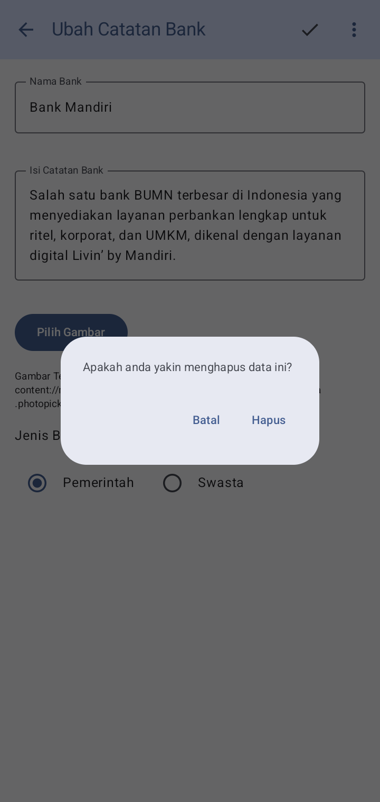
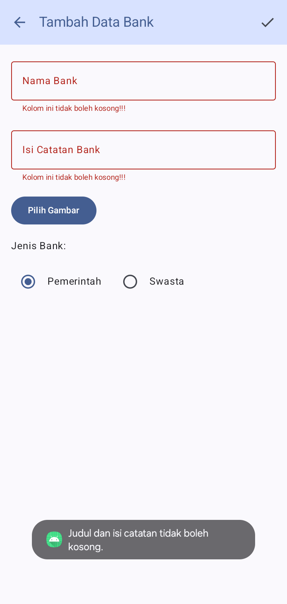

# Assessment Mobpro - Currency Conversion with List of Bank Names / Konversi Mata uang dengan List Nama-nama bank

### Assesment 1 - **Branch : Master** - Currency Conversion / Konversi Mata uang

Konverter Rupiah-Dolar merupakan sebuah aplikasi Android untuk mengkonversi nilai mata uang antara Rupiah (IDR) dan Dolar AS (USD). Pengguna dapat menginput nilai dalam Rupiah untuk dikonversi ke Dolar, atau sebaliknya.

_Rupiah-Dollar Converter is an Android application to convert currency values ​​between Rupiah (IDR) and US Dollar (USD). Users can input the value in Rupiah to be converted to Dollars, or vice versa._

catatan: 
1. Nilai tukar mata uang antara Rupiah dan Dollar masih statis, saya kasih harga 1 dollar = Rp 16.500 (tidak menggunakan real time API berdasarkan kurs nilai tukar mata uang per-hari ini)

_Note:_
_1. The exchange rate between Rupiah and Dollar is still static, I give a price of 1 dollar = Rp 16,500 (not using real time API based on today's currency exchange rate)_

### Assesment 2 - **Branch : Assessment-2-Mobpro**

Pada Assesment 2 ini, saya kembali menggunakan proyek yang sama dengan Assesment 1. Ada beberapa tambahan di aplikasi nya pada Assesment ke-2 ini, yaitu : 

_In this Assessment 2, I again used the same project as Assessment 1. There are several additions to the application in this 2nd Assessment, namely:_

1. **Tombol Plus disamping About. Nantinya kita bisa menambahkan beberapa bank yang ada di Indonesia maupun di Dunia** - _Plus button next to About. Later we can add several banks in Indonesia and in the world_

2. **Tampilan Bahasa Indonesia grid ketika pengaturan terang** - _Indonesian language grid display when setting is bright_

3. **Tampilan Bahasa Indonesia list ketika pengaturan terang** - _Indonesian language list display when setting is bright_

4. **Tampilan Bahasa Inggris grid ketika pengaturan gelap** - _English grid display when dark setting_

5. **Tampilan Bahasa Inggris list ketika pengaturan gelap** - _English list display when dark setting_

6. **Menampilkan dialog konfirmasi hapus data** - _Displays data deletion confirmation dialog_

7. **Validasi ketika menambah atau mengedit data (pada bagian ini, saya hanya memberikan validasi data harus diisi pada kolom Nama Bank & Isi Catatan Bank. Kolom input bagian Gambar boleh kosong, dan pilih jenis bank sudah otomatis antara pemerintah atau swasta)** - _Validation when adding or editing data (in this section, I only provide data validation that must be filled in the Bank Name & Bank Notes columns. The Image input column can be empty, and the bank type selection is automatic between government or private)_

### Link Github

https://github.com/fahritech04/Assessment1Mobpro.git

### Susunan Tim

Nama                    | Username Github   | Posisi       | NIM         |
------------------------|-------------------|--------------|-------------|
Muhammad Raihan Fahrifi | fahritech04       | Mahasiswa    | 6706223009  |

